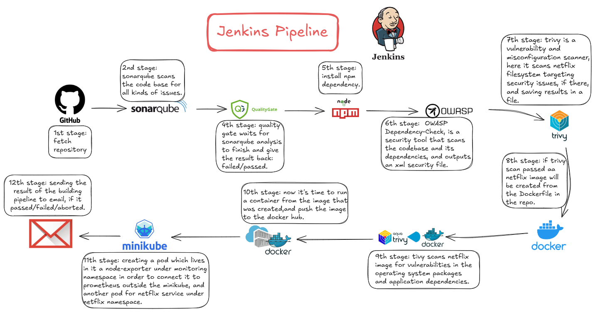

 # 𝐃𝐞𝐯𝐒𝐞𝐜𝐎𝐩𝐬 𝐍𝐞𝐭𝐟𝐥𝐢𝐱 𝐂𝐥𝐨𝐧𝐞 𝐰𝐢𝐭𝐡 𝐂𝐈/𝐂𝐃 𝐚𝐧𝐝 𝐌𝐨𝐧𝐢𝐭𝐨𝐫𝐢𝐧𝐠

In this project, all tools and services are set up on a single local machine, using Minikube to simulate a Kubernetes cluster. The environment includes Jenkins, Docker, Trivy, Prometheus, and Grafana, enabling end-to-end CI/CD, vulnerability scanning, and monitoring—all in one self-contained system.

#### Netflix code source link:
https://github.com/Aj7Ay/Netflix-clone

#### Origina project repository:
https://github.com/NotHarshhaa/DevOps-Projects/tree/master/DevOps-Project-09

## Project Architecture and Tools Used
Local Machine Setup (Outside Minikube):
**Jenkins:** Manages the CI/CD pipeline. It pulls code, runs tests and scans, builds Docker images, and deploys to Kubernetes.
**Docker:** Used to build and push the Netflix app image to DockerHub.
**Trivy:** Scans the file system and Docker images for vulnerabilities.
**Prometheus:** Collects metrics from Jenkins and Kubernetes nodes.
**Grafana:** Visualizes the collected metrics with customizable dashboards.

## Minikube (Local Kubernetes Cluster):
**Netflix Application Pod:** A containerized frontend (built with React + TypeScript) served using NGINX.
**Node Exporter Pod:** Collects system metrics (CPU, memory, disk, etc.) from the Minikube environment and exposes them for Prometheus.

## Key Implementation Steps
#### CI/CD with Jenkins:
* Jenkins fetches the source code from GitHub.
* Runs SonarQube analysis for code quality.
* Performs OWASP Dependency Check and Trivy scans to ensure security.
* Builds a Docker image of the Netflix clone and pushes it to DockerHub.
* Deploys the app into Minikube using kubectl and predefined YAML files.

## Monitoring Setup:
Prometheus is configured to scrape metrics from:
* The Node Exporter pod inside Minikube.
* Jenkins (via Prometheus plugin and /prometheus endpoint).
These metrics are visualized using Grafana with ready-made dashboards (e.g., dashboard ID 1860 for Node Exporter, ID 9964 for Jenkins).

## Security Integration:
* Trivy FS Scan checks for vulnerabilities in source code before the build.
* Trivy Image Scan analyzes the built Docker image for known CVEs.
* OWASP Dependency Check detects insecure third-party libraries.

## Email Notifications:
* Jenkins is integrated with Gmail using an App Password.
* After every pipeline run, Jenkins sends an email with the build result and scan reports attached.

## Result:
* The Netflix app runs inside Minikube and is accessible via a NodePort service.
* Real-time monitoring is available via Grafana dashboards for both Jenkins and the Kubernetes environment.
* The project simulates a real-world DevSecOps pipeline within a single machine, ideal for learning and testing CI/CD, containerization, Kubernetes, security scanning, and observability.

### CI/CD Pipeline Flow in Jenkins:

###  Minikube Cluster Architecture:
